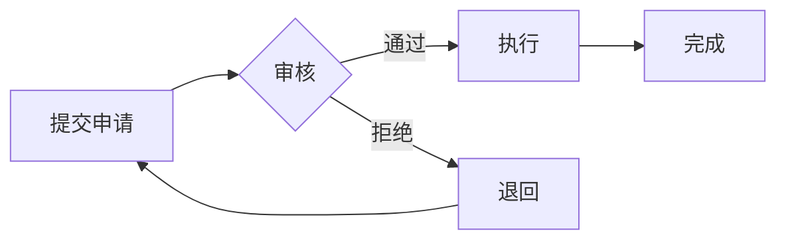

# {功能名称} - 需求分析文档

| 版本 | 日期 | 说明 |
|------|------|------|
| v1 | {日期} | 初始版本 |

---

## 1. 需求概述

{一句话描述功能目的和价值}

## 2. 用户角色

| 角色 | 说明 | 主要操作 |
|------|------|----------|
| {角色1} | {说明} | {操作列表} |

## 3. 功能清单

### 3.1 {端类型1} 功能

| 序号 | 功能 | 说明 | 优先级 |
|------|------|------|--------|
| 1 | {功能名} | {功能描述} | P0/P1/P2 |

### 3.2 {端类型2} 功能

（如有多端）

## 4. 业务流程

### 4.1 主流程

> 简单流程用文字描述，复杂流程（3个以上节点或有分支）用 Mermaid 流程图。

**简单流程示例**（文字）：
```
用户提交 → 管理员审核 → 完成
```

**复杂流程示例**（Mermaid）：


### 4.2 状态流转（如有）

| 当前状态 | 操作 | 目标状态 | 操作人 |
|----------|------|----------|--------|

## 5. 业务规则

| 序号 | 规则描述 | 说明 |
|------|----------|------|
| 1 | {规则} | {补充说明} |

## 6. 数据要求

| 字段 | 说明 | 是否必填 | 备注 |
|------|------|----------|------|
| {字段名} | {说明} | 是/否 | {备注} |

## 7. 关联模块

| 模块 | 关联方式 | 说明 |
|------|----------|------|

## 8. 非功能需求（如有）

- 性能要求：
- 安全要求：
- 其他：

## 9. 确认清单

- [ ] 功能范围确认
- [ ] 业务流程确认
- [ ] 数据字段确认
- [ ] 业务规则确认
