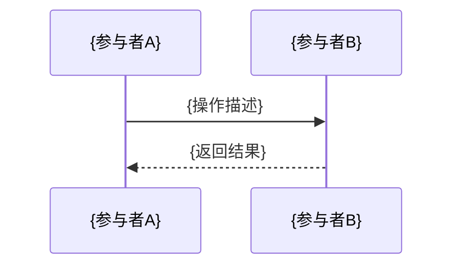
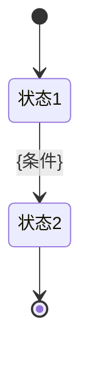

# {功能名称}技术方案

**创建时间**：{YYYY-MM-DD}
**功能模块**：{模块名称}
**文档类型**：技术方案
**文档版本**：v1.0

## 1. 技术架构概述

### 1.1 技术栈
- **后端框架**：Java 17 + Spring Boot 3.x
- **数据访问**：MyBatis-Plus 3.5.x
- **数据库**：MySQL 8.0+
- **缓存**：Redis 7.0+
- **API文档**：Knife4j 4.x

### 1.2 架构设计原则
- **模块化设计**：独立模块，不影响现有功能
- **数据一致性**：使用事务保证关键操作的数据一致性
- **性能优化**：合理使用索引和缓存提升查询性能

## 2. 数据库设计

### 2.1 表结构设计

#### 2.1.1 {表名} ({table_name})
**用途**：{表用途说明}
```sql
CREATE TABLE `{table_name}` (
  `id` bigint NOT NULL AUTO_INCREMENT COMMENT '主键ID',

  -- ========== 业务字段 ==========
  `{field}` {TYPE} {NULL} COMMENT '{字段描述}',

  -- ========== 通用字段 ==========
  `del_flag` tinyint NOT NULL DEFAULT '0' COMMENT '删除标记:0-未删除,1-已删除',
  `create_by` varchar(64) DEFAULT NULL COMMENT '创建者',
  `create_time` datetime NOT NULL DEFAULT CURRENT_TIMESTAMP COMMENT '创建时间',
  `update_by` varchar(64) DEFAULT NULL COMMENT '更新者',
  `update_time` datetime NOT NULL DEFAULT CURRENT_TIMESTAMP ON UPDATE CURRENT_TIMESTAMP COMMENT '更新时间',

  PRIMARY KEY (`id`),
  KEY `idx_{table}_{field}` (`{field}`)
) ENGINE=InnoDB DEFAULT CHARSET=utf8mb4 COMMENT='{表注释}';
```

### 2.2 现有表关联查询（如需要）
**数据来源**：从现有表查询扩展信息
- **基本信息**：从{现有表}获取{字段信息}
- **关联查询示例**：
```sql
-- 查询示例
SELECT
    t1.field1,
    t2.field2
FROM {table1} t1
LEFT JOIN {table2} t2 ON t1.id = t2.{table1}_id
WHERE t1.condition = ?
```

### 2.3 索引设计策略
- **{表名}**：{索引设计说明}

## 3. 接口设计

### 3.1 接口规范
- **统一响应格式**：使用现有R类封装响应
- **RESTful风格**：遵循REST API设计规范
- **参数校验**：使用Spring Validation进行参数校验
- **错误处理**：统一错误码和异常处理

### 3.2 核心接口设计

#### 3.2.1 {功能模块}

**{接口名称}**
```
{METHOD} /api/{module}/{action}

请求参数:
- {param}: {type}, {必填/可选}, {参数说明}

请求体（如POST/PUT）:
{
  "{field}": "{value}"
}

响应:
{
  "code": 0,
  "message": "成功",
  "data": {
    "{field}": "{value}",
    "{field2}": "{value2}"
  }
}

错误码:
- {code}: {错误说明}
```

## 4. 代码结构设计

### 4.1 模块结构
```
ai-toy-core/src/main/java/com/wx/aitoy/core/{module}/
├── controller/           # 控制器层
├── service/             # 服务接口
├── service/impl/        # 服务实现
├── mapper/              # 数据访问层
├── entity/              # 实体类
├── model/request/       # 请求DTO
├── model/response/      # 响应DTO
└── enums/               # 枚举类
```

### 4.2 核心类设计

#### 4.2.1 实体类
- `{Entity}`：{实体说明}

#### 4.2.2 枚举类设计
```java
package com.wx.aitoy.core.{module}.enums;

import lombok.Getter;

/**
 * {枚举说明}
 */
@Getter
public enum {EnumName} {

    {VALUE1}({code}, "{描述}"),
    {VALUE2}({code}, "{描述}");

    private final {Type} code;
    private final String message;

    {EnumName}({Type} code, String message) {
        this.code = code;
        this.message = message;
    }

    /**
     * 根据code获取枚举
     */
    public static {EnumName} getByCode({Type} code) {
        if (code == null) {
            return null;
        }
        for ({EnumName} item : values()) {
            if (item.getCode().equals(code)) {
                return item;
            }
        }
        return null;
    }

    /**
     * 根据code获取message
     */
    public static String getMessageByCode({Type} code) {
        {EnumName} item = getByCode(code);
        return item != null ? item.getMessage() : null;
    }
}
```

#### 4.2.3 服务类
- `{Entity}Service`：{服务说明}

### 4.3 错误码扩展
```java
// {模块}相关 {code_range}
{ERROR_NAME}({code}, "{错误描述}"),
```

## 5. 核心业务逻辑设计

### 5.1 {业务流程名称}

#### 5.1.1 {流程}时序图


#### 5.1.2 {业务}状态图


### 5.2 {其他业务流程}

#### 5.2.1 业务规则
- **{规则1}**：{规则描述}
- **{规则2}**：{规则描述}

#### 5.2.2 {流程}用例图
```mermaid
graph TD
    A[开始] --> B{判断条件}
    B -->|条件1| C[操作1]
    B -->|条件2| D[操作2}]
    C --> E[{结束}]
    D --> E
```

## 6. 部署清单

### 6.1 数据库变更
```sql
-- 执行以下{N}张表的DDL脚本
-- 1. {table1} ({表1说明})
-- 2. {table2} ({表2说明})
```

### 6.2 错误码新增
在ErrorCode枚举中新增{N}个{模块}相关错误码（{code_range}）

### 6.3 代码模块
在ai-toy-core模块新增{module}包，包含：
- {N}个Controller类
- {N}个Service接口和实现类
- {N}个Mapper接口
- {N}个Entity实体类
- {N}个枚举类
- 相关DTO类

### 6.4 接口文档
更新Knife4j文档，新增{N}个{模块}相关接口
