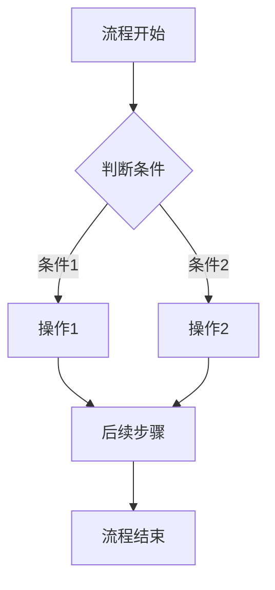

# {功能名称}需求分析

**创建时间**：{YYYY-MM-DD}
**功能模块**：{模块名称}
**文档类型**：需求分析
**文档版本**：v1.0

## 1. 功能概述

### 1.1 业务背景
{描述为什么需要这个功能，解决什么业务问题，在什么业务场景下产生的需求}

### 1.2 功能定位
{一句话描述功能的核心价值和定位}

### 1.3 核心价值
- {为用户/业务带来的价值点1}
- {为用户/业务带来的价值点2}
- {为用户/业务带来的价值点3}

## 2. 用户角色与场景

### 2.1 用户角色
- **{角色1}**：{角色的详细描述，包括职责和权限范围}
- **{角色2}**：{角色的详细描述，包括职责和权限范围}

### 2.2 典型使用场景

#### 场景1：{场景名称}
{详细的场景描述：某用户角色在什么情况下需要做什么事情，期望达到什么目标，整个过程是怎样的}

#### 场景2：{场景名称}
{详细的场景描述}

## 3. 功能需求详述

### 3.1 {功能模块1}

#### 3.1.1 {具体功能名称}
**功能描述**：{详细描述这个功能是做什么的}

**前置条件**：
- {使用此功能需要满足的前置条件1}
- {使用此功能需要满足的前置条件2}

**输入条件**：
- {用户需要提供的输入信息1}
- {用户需要提供的输入信息2}

**输出结果**：
- {功能执行后用户能看到的结果1}
- {功能执行后用户能看到的结果2}

**业务规则**：
- {该功能必须遵循的业务规则1}
- {该功能必须遵循的业务规则2}

#### 3.1.2 {具体功能名称}
{按照上述格式继续描述其他功能}

### 3.2 {功能模块2}
{按照上述格式描述其他功能模块}

## 4. 业务流程

### 4.1 {主要流程名称}

{对于简单流程（≤3步），用文字描述：}
```
步骤1 → 步骤2 → 步骤3
```

{对于复杂流程（>3步或有分支），必须使用Mermaid流程图：}


### 4.2 {其他重要流程名称}
{继续描述其他重要的业务流程}

## 5. 数据需求

### 5.1 核心数据实体

#### 5.1.1 {数据实体1}
- {从业务角度描述这个实体包含哪些信息}
- {这个实体在业务中的作用和意义}

#### 5.1.2 {数据实体2}
- {从业务角度描述这个实体包含哪些信息}
- {这个实体在业务中的作用和意义}

### 5.2 数据约束规则

#### 5.2.1 唯一性约束
- {哪些数据在业务上必须保持唯一}

#### 5.2.2 业务约束
- {数据必须满足的业务规则和约束条件}

## 6. 非功能性需求

### 6.1 性能需求
- **用户规模**：{预期的用户数量和并发量}
- **响应时间**：{各类操作的响应时间要求}
- **数据量**：{预期的数据规模}

### 6.2 可用性需求
- {系统可用性要求}
- {服务时间要求}
- {容错能力要求}

### 6.3 安全需求
- {权限控制要求}
- {数据安全要求}
- {其他安全相关要求}

### 6.4 兼容性需求
- {与现有系统的兼容性要求}
- {未来扩展的兼容性考虑}

## 7. 约束条件

### 7.1 技术约束
- **系统架构**：{现有技术架构的约束}
- **消息通知方式**：{实时推送 vs 轮询机制，轮询频率要求}
- **数据实时性**：{哪些数据需要实时查询，存储方式}
- **数据保留策略**：{永久保存 vs 定期清理策略}
- **系统集成**：{与现有系统的集成方式}
- **技术选型**：{技术选型的约束}

### 7.2 业务约束
- {业务流程的约束}
- {业务规则的约束}
- {合规性要求}

### 7.3 时间约束
- {项目时间要求}
- {分阶段交付要求}

## 8. 验收标准

### 8.1 功能验收标准
- {功能完整性验收标准}
- {业务流程验收标准}
- {用户体验验收标准}

### 8.2 性能验收标准
- {响应时间验收标准}
- {并发能力验收标准}
- {稳定性验收标准}

### 8.3 安全验收标准
- {权限控制验收标准}
- {数据安全验收标准}

## 9. 风险评估

### 9.1 技术风险
- {技术风险1}（{风险等级：高/中/低}）
- {技术风险2}（{风险等级：高/中/低}）

### 9.2 业务风险
- {业务风险1}（{风险等级：高/中/低}）
- {业务风险2}（{风险等级：高/中/低}）

### 9.3 风险应对
- {针对主要风险的应对措施}

---

## 确认清单

在进入技术方案设计阶段前，请确认：

- [ ] 功能范围是否完整？
- [ ] 业务流程是否正确？
- [ ] 用户场景是否覆盖全面？
- [ ] 业务规则是否明确？
- [ ] 数据需求是否清晰？
- [ ] 非功能性需求是否合理？
- [ ] 约束条件是否明确？
- [ ] 验收标准是否可执行？
- [ ] 是否有遗漏的功能点或业务规则？