# 项目开发规范与 Claude Skills

> 基于 Java Spring Boot 的企业级项目开发规范，配套 Claude Code 技能集，实现标准化、自动化的开发流程。

## 📋 版本历史

| 版本 | 日期 | 说明 |
|------|------|------|
| v1.0 | 2025-01-15 | 初始版本 |
| v1.1 | 2025-01-16 | 新增 4.3 强制执行规则章节 |
| v1.2 | 2025-01-16 | 重构 /analyze 为两阶段流程（需求分析 + 技术方案） |
| v2.1 | 2026-01-16 | 完善开发流程，增加 review/test 必做环节 |
| v2.2 | 2026-01-17 | 完善需求变更流程，强化测试和文档同步 |
| v3.0 | 2026-01-19 | 添加持续优化 claude、skill |
| v3.1 | 2026-01-20 | 修改为全流程任务，防止中断后无法继续 |
| v3.2 | 2026-01-23 | 新增 proj-resume 技能，完善中断恢复机制 |
| v3.3 | 2026-01-28 | 新增 proj-sync-doc 技能，补齐文档同步能力 |

## 🎯 项目概述

本项目提供了一套完整的 Java Spring Boot 项目开发规范，包含：

- **标准化开发流程**：从需求分析到代码提交的完整流程
- **Claude Skills 技能集**：14 个专业技能，覆盖开发全生命周期
- **代码生成模板**：Entity、Service、Controller 等标准模板
- **质量保证体系**：代码审查、测试生成、安全检查

### 技术栈

- **框架**：Java 17 + Spring Boot 3.x + MyBatis-Plus 3.5.x
- **数据库**：MySQL 8.0+ + Redis 7.0+
- **API文档**：Knife4j 4.x
- **测试框架**：JUnit 5 + Mockito + AssertJ
- 
## 🚀 快速开始

### 1. 导入技能集

将本项目的 `.claude/skills` 目录复制到你的项目根目录：

```bash
cp -r project-standards/.claude/skills your-project/.claude/
```

### 2. 常用入口

```bash
/proj-analyze-req
/proj-analyze-design
/proj-task
/proj-gen
/proj-review
/proj-gen-test
```

## 🛠️ Claude Skills 技能集

### 流程类技能

| 技能 | 描述 | 使用场景 |
|------|------|----------|
| `/proj-analyze-req` | 需求分析与确认 | 新需求开始，澄清需求、明确边界 |
| `/proj-analyze-design` | 技术方案设计 | 需求确认后，设计数据库、接口、代码结构 |
| `/proj-task` | 任务管理 | 方案确认后拆分任务，跟踪开发进度 |
| `/proj-review` | 代码审查 | 代码完成后自检，安全性能检查 |

### 生成类技能

| 技能 | 描述 | 使用场景 |
|------|------|----------|
| `/proj-gen` | 代码生成统一入口 | 生成 SQL、Entity、Service、Controller |
| `/proj-gen-test` | 测试代码生成 | 生成单元测试和集成测试 |

### 辅助类技能

| 技能 | 描述 | 使用场景 |
|------|------|----------|
| `/proj-fix` | Bug 快速修复 | 线上问题快速定位和修复 |
| `/proj-change` | 需求变更处理 | 开发过程中需求调整 |
| `/proj-common` | 公共规范查看 | 查看响应格式、错误码等规范 |
| `/proj-deploy` | 部署配置生成 | 生成 Docker、Nginx 配置 |
| `/proj-refactor` | 代码重构指南 | 改善代码质量，消除代码坏味道 |
| `/proj-optimize` | 持续优化 | 记录问题，批量优化，自我进化 |
| `/proj-resume` | 中断后快速恢复开发进度 | 对话中断后继续开发、新会话接续之前的工作 |
| `/proj-sync-doc` | 文档与单测同步 | 基于 Git 提交/代码变更同步需求/技术文档并补单元测试 |

## 🔄 常用流程

### 新功能开发

```mermaid
graph LR
    A[需求分析] --> B[用户确认]
    B --> C[技术方案]
    C --> D[用户确认]
    D --> E[任务拆分]
    E --> F[代码生成]
    F --> G[业务开发]
    G --> H[代码审查]
    H --> I[生成测试]
    I --> J[运行测试]
    J --> K[用户确认]
    K --> L[Git提交]
```



### 需求变更

```mermaid
graph LR
    A[需求变更] --> B[代码修改]
    B --> C[代码审查]
    C --> D[生成测试]
    D --> E[运行测试]
    E --> F[文档同步]
```



## 📁 技能目录结构

```
project-standards/
├── CLAUDE.md                    # 核心开发规范文档
├── README.md                    # 项目说明文档
└── .claude/skills/              # Claude Skills 技能集
    ├── proj-analyze-req/        # 需求分析技能
    │   ├── SKILL.md
    │   └── templates/
    ├── proj-analyze-design/     # 技术方案设计技能
    │   ├── SKILL.md
    │   └── templates/
    ├── proj-gen/                # 代码生成技能
    │   ├── SKILL.md
    │   └── templates/
    │       ├── entity.md        # Entity 模板
    │       ├── service.md       # Service 模板
    │       ├── controller.md    # Controller 模板
    │       ├── dto.md           # DTO 模板
    │       └── sql-reference.md # SQL 参考
    ├── proj-review/             # 代码审查技能
    │   ├── SKILL.md
    │   └── templates/
    ├── proj-gen-test/           # 测试生成技能
    │   ├── SKILL.md
    │   └── templates/
    ├── proj-resume/             # 开发进度恢复技能
    │   └── SKILL.md
    ├── proj-sync-doc/           # 文档与单测同步技能
    │   └── SKILL.md
    ├── proj-common/             # 公共规范
    │   ├── SKILL.md
    │   ├── response.md          # 响应格式规范
    │   ├── errorcode.md         # 错误码规范
    │   └── exception.md         # 异常处理规范
    └── [其他技能目录...]
```

## 🔧 使用示例

### 开发新功能

```bash
# 1. 开始需求分析
/proj-analyze-req
# 输入：用户需求描述
# 输出：需求分析文档

# 2. 设计技术方案
/proj-analyze-design
# 输入：确认的需求
# 输出：技术方案文档

# 3. 拆分开发任务
/proj-task
# 输入：技术方案
# 输出：任务清单

# 4. 生成代码骨架
/proj-gen
# 输入：技术方案
# 输出：Entity、Service、Controller 等

# 5. 开发业务逻辑
# 手动编写具体业务代码

# 6. 代码自检
/proj-review
# 输入：完成的代码
# 输出：审查报告和修复建议

# 7. 生成测试代码
/proj-gen-test
# 输入：业务代码
# 输出：单元测试和集成测试
```

### 处理需求变更

```bash
# 1. 记录需求变更
/proj-change
# 输入：变更内容
# 输出：影响分析和变更计划

# 2. 修改代码
# 根据变更计划修改相关代码

# 3. 重新审查
/proj-review

# 4. 更新测试
/proj-gen-test
```

### 恢复中断的开发

```bash
# 1. 恢复开发进度
/proj-resume
# 输入：无需输入
# 输出：当前开发状态和下一步指令

# 2. 继续开发
# 根据恢复信息继续完成当前任务

# 3. 更新任务状态
# 完成任务后及时更新状态标记
```

## 🤝 贡献指南

1. Fork 本项目
2. 创建特性分支 (`git checkout -b feature/AmazingFeature`)
3. 提交更改 (`git commit -m 'Add some AmazingFeature'`)
4. 推送到分支 (`git push origin feature/AmazingFeature`)
5. 开启 Pull Request

## 📄 许可证

本项目采用 MIT 许可证 - 查看 [LICENSE](LICENSE) 文件了解详情。

## 🙋‍♂️ 支持

如有问题或建议，请：

1. 查看 [CLAUDE.md](CLAUDE.md) 了解详细规范
2. 提交 [Issue](https://github.com/your-username/project-standards/issues)
3. 参与 [Discussions](https://github.com/your-username/project-standards/discussions)

---

**让开发更标准，让质量更可靠！** 🚀
